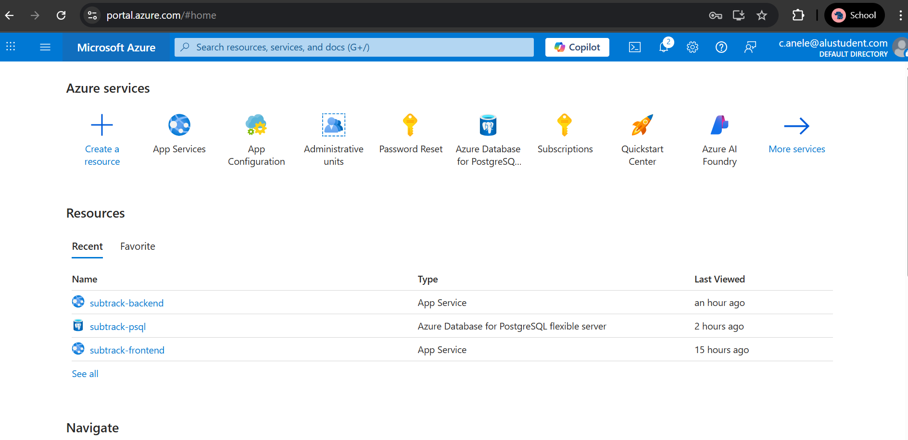
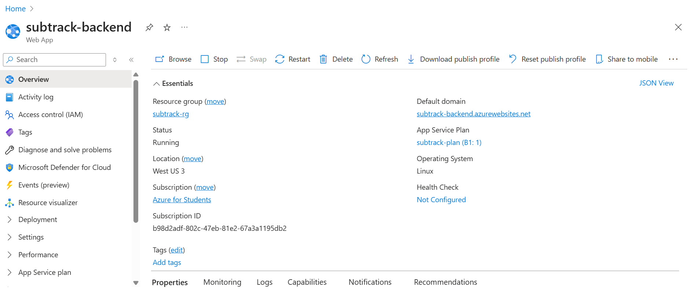
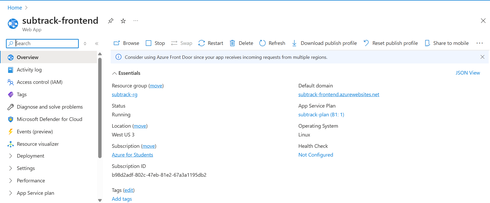
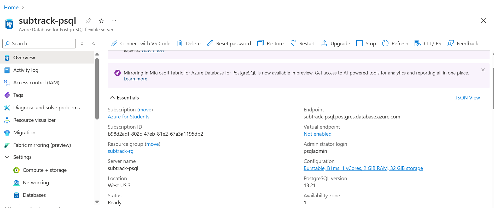
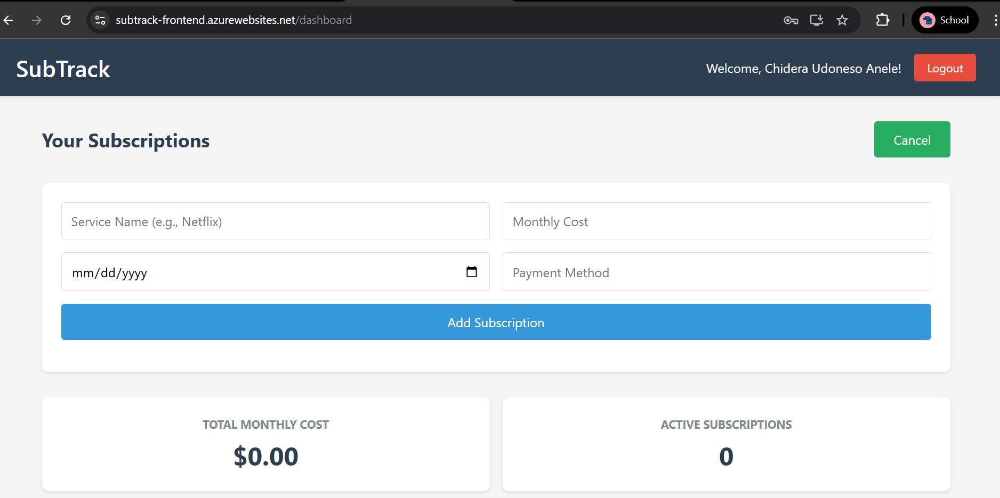

# Deployment Phase Submission

## Live Public URL

Paste your live app URL here ( https://subtrack-frontend.azurewebsites.net)

## Peer Review

Link to the Pull Request you reviewed for your peer:
[https://github.com/OIgboerika/Consistly_app/pull/16]

## Reflection: Challenges of IaC and Manual Deployment

-   **IaC (Infrastructure as Code)**: Writing Terraform scripts for Azure resources was powerful but required careful attention to resource dependencies, naming, and provider quirks. Debugging errors (like region restrictions or state issues) was time-consuming.
-   **Manual Deployment**: Pushing Docker images, updating App Service settings, and troubleshooting environment variables and connection strings was tedious. Azure's UI sometimes hid important options (like password reset or configuration), and propagating changes (like password resets) could take several minutes, making debugging slow.
-   **Biggest Challenge**: Ensuring the backend could connect to the Azure PostgreSQL Flexible Server, especially with username format and SSL requirements, was the most difficult part. Cloud Shell was essential for bypassing local firewall issues.
-   **Lesson Learned**: Automate as much as possible, double-check all credentials, and always test cloud connectivity from a cloud-based shell if local attempts fail.

---

## **Required Screenshots for Provisioned Resources**

-   Reference:
    
    
    
    
    

---

## **Summary Table**

| Screenshot                    | Where to Find in Azure Portal           |
| ----------------------------- | --------------------------------------- |
| Resource Group Overview       | Resource Group > Overview/Resources tab |
| Backend App Service Overview  | subtrack-backend > Overview             |
| Frontend App Service Overview | subtrack-frontend > Overview            |
| PostgreSQL Server Overview    | subtrack-psql > Overview                |
| Live App in Browser           | Your live app URL                       |
